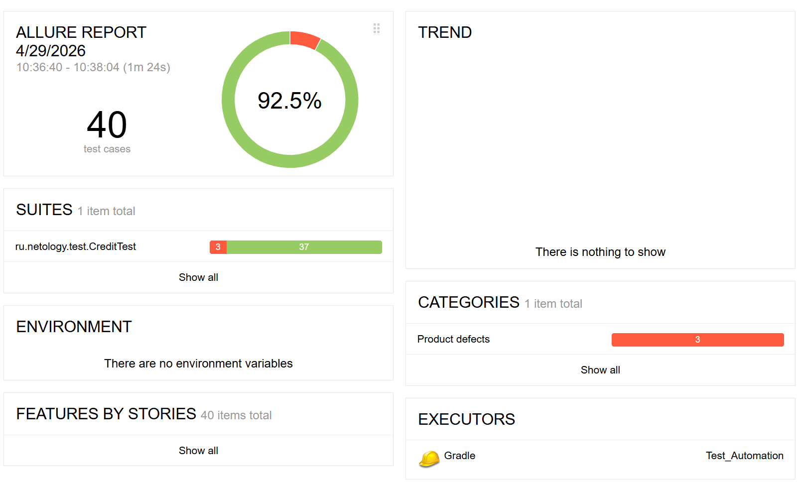
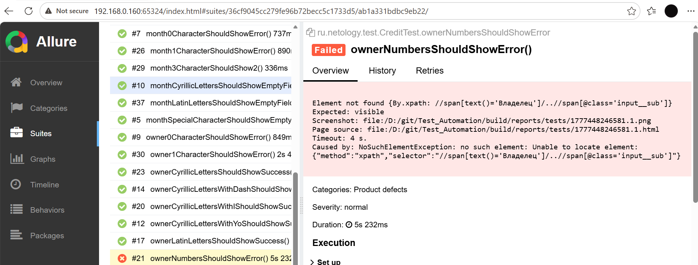
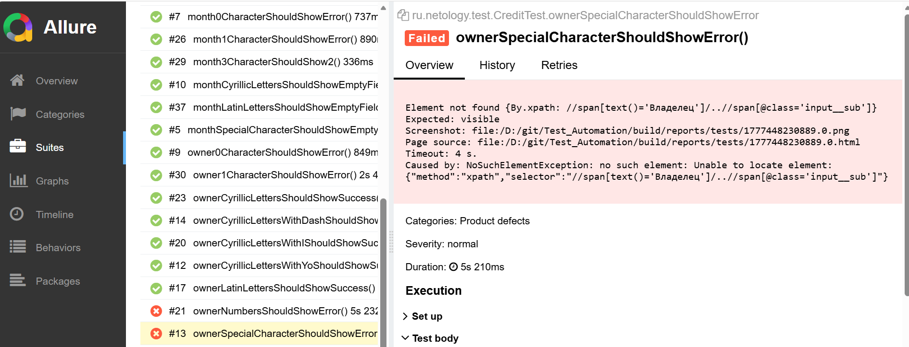
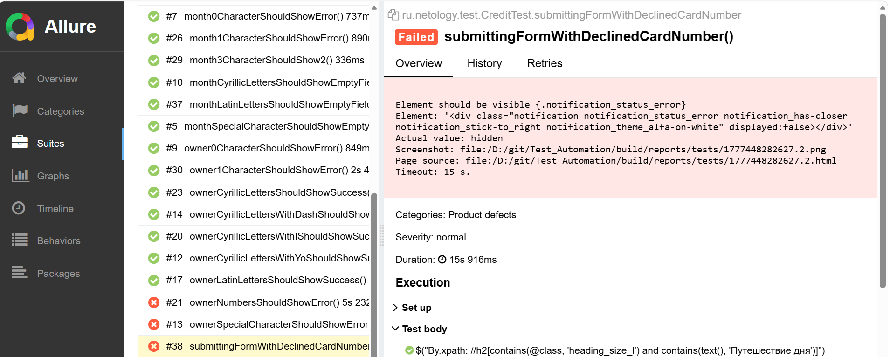

# Отчёт о проведённом тестировании
* Краткое описание
Проведено функциональное тестирование формы "Купить в кредит" на сайте http://localhost:8080/.
*Цель* — проверка валидации полей и отправки формы с различными наборами данных (валидные, невалидные, граничные значения).
Тестирование включало как ручную, так и автоматизированную проверку.

* Количество тест-кейсов
Выполнено 40 тест-кейсов

* Процент успешных и не успешных тест-кейсов
Всего тестов	40
Пройдено (PASSED)	37
Провалено (FAILED)	3

* Общие рекомендации
Выпускать в продуктивную среду не рекомендуется до устранения дефектов поля "Владелец" 